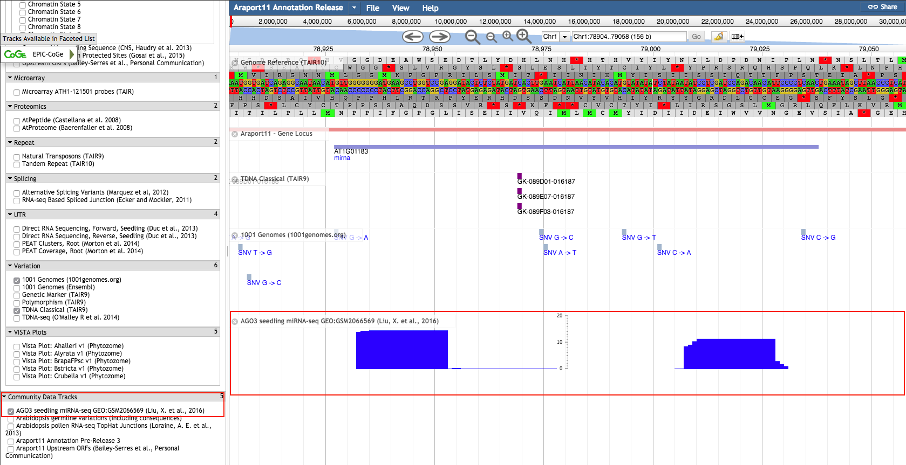

![AIP][1] CyverseRemoteTracks v0.1 (work-in-progress)
---

### Description

CyverseRemoteTracks is a plugin that loads JBrowse-compatible track configurations and data from resources hosted 
within the [CyVerse][cyverse] Data Store.

This plugin is developed to work in conjunction with an app published within the CyVerse [Discovery Environment][DE], 
called [Deploy Community Tracks][deploy-community-tracks], that allows the Araport User Community members to upload 
GFF3/BED/BAM/VCF formatted data files via the interface, which are pre-processed, indexed (using Tabix or SAMTools), 
and stored in the CyVerse DE, along with supporting JBrowse track config files. The workflow also changes the ACLs on 
these files to allow `anonymous` access.

The CyverseRemoteTracks plugin uses the [Agave Files API][agave-files-api] to find all JBrowse tracks conf files located 
on the CyVerse Data Store and dynamically add these tracks to the Hierarchical Track List.

### Usage

The CyverseRemoteTracks plugin can be enabled using either of the following methods (see official 
[JBrowse documentation][jb-config-docs] on using plugins):

`tracks.conf`

		[plugins]
		ComboTrackSelector.location += ./plugins/CyverseRemoteTracks
		CyverseRemoteTracks.accessToken += <insert-agave-api-token-here>
		CyverseRemoteTracks.filesApiBaseUrl += https://agave.iplantc.org/files/v2
		CyverseRemoteTracks.storageSystemId += data.iplantcollaborative.org
		CyverseRemoteTracks.anonFilesBaseUrl += https://de.cyverse.org/anon-files/iplant/home
		CyverseRemoteTracks.configFilesPath += araport/community-tracks/shared

`trackList.json`

		"plugins": [
			{
				"name += CyverseRemoteTracks",
				"location": "./plugins/CyverseRemoteTracks",
				"accessToken": "<insert-agave-api-token-here>",
				"filesApiBaseUrl": "https://agave.iplantc.org/files/v2",
				"storageSystemId": "data.iplantcollaborative.org",
				"anonFilesBaseUrl": "https://de.cyverse.org/anon-files/iplant/home",
				"configFilesPath": "araport/community-tracks/shared"
			}
		]

Once enabled and configured correctly, the CyverseRemoteTracks should appear as seen below:

### Contributors

* [Vivek Krishnakumar](https://github.com/vivekkrish) - JCVI

* * *

If you have any questions regarding the usage of this plugin, please write to <mailto:araport@jcvi.org>

[1]: http://bit.ly/aip-logo
[cyverse]: https://www.cyverse.org
[de]: https://de.cyverse.org/de
[deploy-community-tracks]: https://github.com/Arabidopsis-Information-Portal/deploy-community-tracks/blob/master/TUTORIAL.md
[agave-files-api]: http://developer.agaveapi.co/#files
[jb-config-docs]: http://gmod.org/wiki/JBrowse_Configuration_Guide#Using_Plugins
